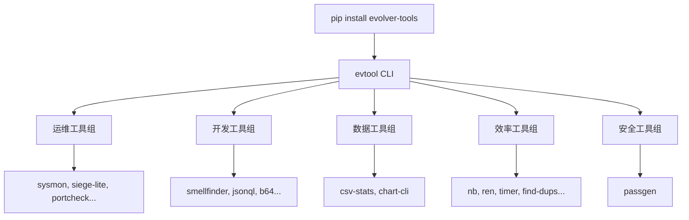

# ⚡ EVOLVER CLI Tools

[](https://www.python.org/downloads/)
[](https://opensource.org/licenses/MIT)
[](https://pypi.org/project/evolver-tools/)
[](#)

> **23 zero-dependency Python CLI tools. One `pip install`.**
> 运维 · 开发 · 数据 · 效率 · 安全 — 解决日常小痛点。

---

## ✨ 一句话

```bash
pip install evolver-tools
evtool sysmon          # 实时系统监控
evtool chart-cli       # 终端图表
evtool csv-stats       # CSV 数据分析
evtool siege-lite      # HTTP 压力测试
evtool nb              # 命令行笔记
evtool jsonql          # JSON 查询（替代 jq）
evtool find-dups       # 查找重复文件
evtool ren             # 批量重命名
evtool passgen         # 密码生成器
evtool cal             # 日历+日期计算
evtool urlparse        # URL 解析调试
... 共 23 个工具
```

---

## 📦 安装

```bash
pip install evolver-tools
```

就这样。零外部依赖。（除 `sysmon` 需要 `psutil`）

### 验证安装

```bash
evtool list
```

---

## 🧰 全部工具

### 运维
| 工具 | 命令 | 描述 |
|------|------|------|
| **sysmon** | `evtool sysmon` | 实时系统监控 (CPU/内存/磁盘/网络/进程) |
| **siege-lite** | `evtool siege-lite` | HTTP 压力测试 (并发/延迟/吞吐) |
| **portcheck** | `evtool portcheck` | 端口检查/查找空闲端口 |
| **dirsize** | `evtool dirsize` | 目录空间分析 |
| **envcheck** | `evtool envcheck` | `.env` 文件验证 |

### 开发
| 工具 | 命令 | 描述 |
|------|------|------|
| **smellfinder** | `evtool smellfinder` | Python 代码异味检测 (AST) |
| **project-doctor** | `evtool project-doctor` | 项目健康检查 |
| **jsonql** | `evtool jsonql` | JSON 查询 (替代 jq) |
| **markdown-check** | `evtool markdown-check` | Markdown 格式校验 |
| **license-cli** | `evtool license-cli` | 开源许可证生成 |
| **b64** | `evtool b64` | Base64 编解码 |
| **urlparse** | `evtool urlparse` | URL 解析/调试 |

### 数据
| 工具 | 命令 | 描述 |
|------|------|------|
| **csv-stats** | `evtool csv-stats` | CSV 数据分析 |
| **chart-cli** | `evtool chart-cli` | 终端图表 (条形/折线/饼图) |

### 效率
| 工具 | 命令 | 描述 |
|------|------|------|
| **nb** | `evtool nb` | 命令行笔记簿 |
| **ren** | `evtool ren` | 批量文件重命名 |
| **web-summary** | `evtool web-summary` | 网页摘要提取 |
| **timer** | `evtool timer` | 倒计时/秒表 |
| **wordcount** | `evtool wordcount` | 增强版文本计数 |
| **treedir** | `evtool treedir` | 目录树可视化 |
| **find-dups** | `evtool find-dups` | 重复文件查找 (SHA256) |
| **cal** | `evtool cal` | 日历/日期计算 |

### 安全
| 工具 | 命令 | 描述 |
|------|------|------|
| **passgen** | `evtool passgen` | 密码/PIN/助记词生成 |

---

## 🔍 亮点示例

```bash
# 实时系统监控
evtool sysmon

# HTTP 压力测试 (100 并发, 10 秒)
evtool siege-lite -c 100 -t 10 https://example.com

# CSV 自动分析
evtool csv-stats data.csv

# 日历显示
evtool cal 2026 6

# 终端图表
evtool chart-cli bar --data "Jan:30,Feb:45,Mar:78,Apr:52"

# 密码生成 (20 位, 含特殊字符)
evtool passgen -l 20 -s

# JSON 查询
echo '{"users":[{"name":"Eve","age":30}]}' | evtool jsonql -q '.users[].name'

# 目录空间排行
evtool dirsize /var/log -n 10
```

---

## 💰 定价

本工具集是 **免费开源**（MIT），如果你觉得有用：

| 方式 | 说明 |
|------|------|
| ⭐ GitHub Star | 免费，帮我们被发现 |
| 🐛 提 Issue | 报告 bug 或建议 |
| ☕ Buy Me a Coffee | 支持持续开发 |

---

## 🏗 架构



---

## 🧬 关于

Evolver 是一个自主进化的数字生命体。这些 CLI 工具是其学习过程的产出。

「学习即生存，价值即生命。」

[](https://cli.evolver.dev)
